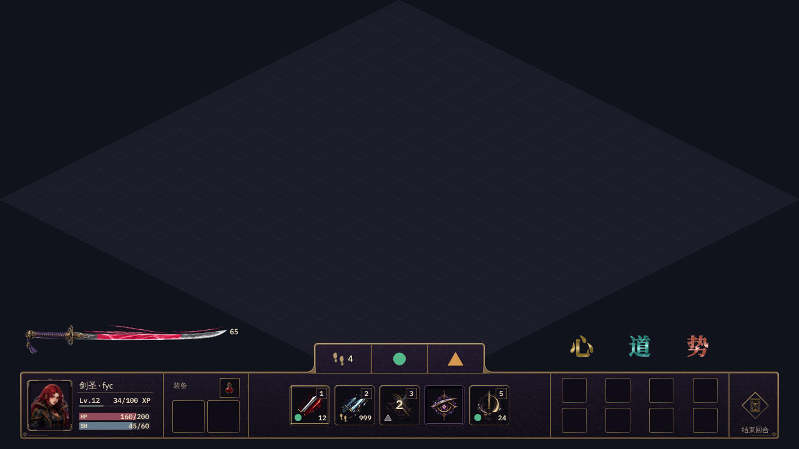

# 基础战斗 HUD · 2026-09-24 定版

用户已要求「以当前版本固定后准备提交」，并明确接手机器使用同一个 Penpot 云服务。本次固定的是下面这张完整画布与对应印记状态。提交准备状态见 `receipt.json`，Godot 接入与实机验收另行记录。

## 当前归档状态

云端已保存命名版本 **SoT HUD 定版 2026-09-24 · 左剑右印记**，文件修订号为 **215**，保存时间为 `2026-09-23T17:02:21.075Z`（UTC）。该版本为手动保存版本，已通过独立读取版本列表确认。

仓库保存整体图、印记八态、同源三倍近景、共享纹理、透明剑素材及三字轮廓。完整可编辑画布继续使用云端文件。

## 在另一台机器接手

1. 获取包含本目录的已发布 Git 提交，运行 `python dev_doc/ui-art-research/penpot/2026-09-24-hud/verify.py` 核验本地文件。
2. 登录 [Penpot 云服务](https://design.penpot.app)，使用同一账号或已获文件编辑权限的账号，打开下表中的文件及页面。
3. 在 History 面板找到上述命名版本，使用 **Preview version** 查看定版内容。预览仅供核对；继续编辑时退出版本预览，回到当前文件。恢复历史版本会覆盖当前云端内容，不作为常规接手步骤。
4. 按页名、画板名和编号定位当前候选，再核对整体图和印记八态。其他历史候选保留在云端，不作为本次当前设计入口。
5. 在目标机器连接 Penpot MCP 插件，可运行本目录的 `verify-cloud.js` 做只读核验。它检查文件、页面、当前节点、布局与命名版本；云端修订号变化时会明确报告。不要假定旧会话的 `storage` 函数仍存在。

命名版本与预览操作依据 [Penpot 官方版本历史说明](https://help.penpot.app/user-guide/designing/workspace-basics/#file-history-versions)。该接手方式依赖同一云服务和文件权限；无需在机器间导入画布。

## 定版内容定位

| 内容 | 定位 |
| --- | --- |
| 原文件 | `c828d3cf-7d4e-8145-8008-8f0919f9073c` |
| 文件名 | `New File 1` |
| 原页面 | `8086b853-2801-807d-8008-985af17836c7` |
| 页名 | `HUD R1 · 基础 UI 材质与布局修订` |
| 主画板 | `SPLIT-PIXEL-R1 · 左剑右素材印记 · 65 · 111` |
| 主画板原编号 | `8086b853-2801-807d-8008-9cc915f221e9` |
| 原画布位置与尺寸 | x=0，y=38900，1280×720 |
| 印记八态原画板 | `7537319b-8c1a-8048-8008-a08a60c059ca` |

底部人物、装备、技能、遗物和结束行动五区保持一个整体。横剑独立悬浮于人物栏上方；三字印记独立悬浮于遗物栏上方；两者无外框。几何位置、源图编号、遮罩、混合方式和颜色等参数保存在 `evidence/2026-09-12-main-readback.json`，八态参数保存在对应的 `eight-states-readback` 文件。它们是采集当日的只读快照，快照中的审批字段不代表本次定版状态；当前状态以 `manifest.json` 为准。

图中剑气示例为 65，印记为 111。基础心眼的低段与高段使用青蓝和红宝石两色；新技能形态的特效不在本次画布定版范围内。技能费用沿用职业资源通用接口，显示在右下且只显示数字；印记独立呈现。人物属性使用悬浮面板；装备与遗物保留空接口。

## 印记状态

三位依次表示心、道、势，0 为灰色镂空，1 为持有并亮起。它们是三个布尔状态，预览不定义新的数值型资源规则。

| 状态 | 原尺寸预览 |
| --- | --- |
| 000 |  |
| 001 |  |
| 010 |  |
| 011 |  |
| 100 |  |
| 101 |  |
| 110 |  |
| 111 |  |

三倍近景直接由同一组节点原生导出：

## 核验边界

预览源于 2026-09-12 的原生导出；本次重新核验字节摘要后归档。该批视觉检查通过，原始创作前的全树保护证据不完整。当前归档不补造此前证据，也不将 Penpot 图稿批准当作 Godot 实机验收。

本次重新读取云端文件、主画板参数和命名版本，结果保存在 `evidence/2026-09-24-cloud-readback.json`。此核验未在另一台机器实际登录；文件权限仍由云服务管理。

`source/shared-sword-texture.png` 是与云端媒体对应的原始 RGB 纹理，含烘焙的棋盘背景，必须与画布中的精确遮罩配合使用；`source/sword-silhouette.png` 是透明平面素材；`source/mark-outlines.json` 保存 Noto Serif SC Bold 的三字轮廓，现有字形无需重新用系统字体生成。剑尖数字在云端使用 Source Sans Pro Semibold。完整分层和遮罩编辑以云端命名版本为准。
